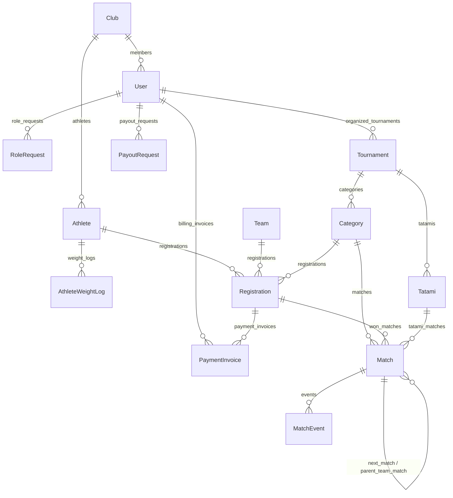

# 🥋 Tournament Master — вебсервіс з проведення турнірних змагань

[](https://github.com/gemnyl/TournamentSystem/actions/workflows/ci.yml)
[](https://sonarcloud.io/summary/new_code?id=gemnyl_TournamentSystem)
[](https://sonarcloud.io/summary/new_code?id=gemnyl_TournamentSystem)
[](https://www.python.org/)
[](https://www.djangoproject.com/)
[](https://react.dev/)
[](https://www.typescriptlang.org/)

**Tournament Master** — це повноцінний вебсервіс для планування, адміністрування та проведення спортивних турнірів з контактних видів спорту й бойових мистецтв (карате WKF, ката, дзюдо, тхеквондо). Система автоматизує реєстрацію учасників, зважування, безпомилкове жеребкування з розведенням одноклубників, ведення протоколів поєдинків та трансляцію перебігу змагань у режимі реального часу на табло й панелі суддів.

> Програмний комплекс розроблено в межах кваліфікаційної роботи бакалавра за спеціальністю **121 «Інженерія програмного забезпечення»** (Державний університет «Житомирська політехніка», група ІПЗ-22-3).
> **Тема:** «Вебсервіс з проведення турнірних змагань». **Розробник:** Муравицький Владислав Юрійович.

---

## 📑 Зміст

- [Ключові можливості](#-ключові-можливості)
- [Технологічний стек](#-технологічний-стек)
- [Архітектура системи](#-архітектура-системи)
- [Функціональні модулі (Django-застосунки)](#-функціональні-модулі-django-застосунки)
- [Дисципліни та формати сіток](#-дисципліни-та-формати-сіток)
- [Модель даних (ER-діаграма)](#-модель-даних-er-діаграма)
- [Огляд REST API](#-огляд-rest-api)
- [Структура репозиторію](#-структура-репозиторію)
- [Розгортання та запуск](#-розгортання-та-запуск)
- [Демо-дані та облікові записи](#-демо-дані-та-облікові-записи)
- [Тестування та якість коду](#-тестування-та-якість-коду)
- [Рольова модель доступу](#-рольова-модель-доступу)
- [Ліцензія та авторство](#-ліцензія-та-авторство)

---

## ✨ Ключові можливості

- **Повний життєвий цикл турніру** — від чернетки та відкриття реєстрації до активної фази й завершального протоколу з підрахунком призових місць.
- **Автоматичне жеребкування** з вирівнюванням до найближчого ступеня двійки, розрахунком BYE-проходів та **евристичним розведенням представників одного клубу** в перших раундах.
- **Чотири формати сіток** — одинарне вибування, подвійне вибування з втішними поєдинками (repechage), коловий формат «кожен з кожним» і швейцарська система з оптимальним паруванням.
- **П'ять дисциплін суддівства** з різними парадигмами оцінювання, реалізованими як змінні стратегії (карате-кумите, ката, дзюдо, тхеквондо, шобу-іппон).
- **Суддівство в режимі реального часу** — нарахування балів, попередження, запуск/зупинка таймера й фіксація переможця миттєво транслюються на табло глядачів і в інші панелі через WebSocket.
- **Авторитетний серверний таймер** із синхронізацією годинника клієнта за принципом, наближеним до NTP, що забезпечує однакові покази на всіх екранах.
- **Командні зустрічі** з послідовністю індивідуальних боїв, додатковими боями (tie-breaker) і підрахунком командного рахунку.
- **Керування майданчиками (татамі)** — призначення суддів, розподіл категорій, черга поєдинків і окремий режим інформаційного табло для проєкціювання в залі.
- **Електронний білінг** — онлайн-оплата внесків через Monobank (з режимами sandbox і mock), комісія платформи, кредитний ліміт організатора та запити на виплату на реквізити IBAN.
- **Рольова модель доступу (RBAC)** з модерацією заявок на ролі тренера й судді та підтвердженням завантаженими документами.
- **Автентифікація** на сеансах Django, вхід через Google OAuth, підтвердження електронної пошти та відновлення пароля.
- **Експорт даних** до Excel (`openpyxl`) і сучасна адмін-панель на базі `django-unfold` з імпортом/експортом.

---

## 🧰 Технологічний стек

| Шар | Технології |
| :--- | :--- |
| **Backend** | Python 3.12, Django 5.x, Django REST Framework 3.15+, Django Channels 4.x (ASGI/Daphne), `django-filter`, `django-cors-headers`, `django-unfold`, `django-import-export`, Pillow, openpyxl |
| **Real-time** | Django Channels + Redis Pub/Sub (channels-redis), WebSockets |
| **База даних** | PostgreSQL 16, доступ через `psycopg` 3 |
| **Кеш / брокер подій** | Redis 7 |
| **Frontend** | React 19, TypeScript 5.5, Vite 7, React Router 7, Zustand 5, Axios, React Hook Form + Zod |
| **UI** | TailwindCSS 3.4, Radix UI, lucide-react, react-markdown + DOMPurify |
| **Платежі** | Monobank Acquiring API (sandbox / mock-режим для розробки) |
| **Інфраструктура** | Docker, Docker Compose, Nginx (роздавання SPA) |
| **Якість і CI/CD** | Ruff, Pytest + Coverage, ESLint, `tsc`, Playwright (E2E), GitHub Actions, SonarCloud, Codecov |

---

## 🏗 Архітектура системи

Серверну частину побудовано як **модульний моноліт (Modular Monolith)**: єдиний застосунок, поділений на слабозв'язані доменні модулі з чітко окресленими зонами відповідальності та односпрямованими залежностями. Такий вибір зумовлений високими вимогами до цілісності транзакцій (ACID) під час жеребкування й одночасного оновлення стану поєдинків кількома суддівськими бригадами.

```
┌──────────────────────────────────────────────────────────────────────────┐
│                               FRONTEND                                     │
│             React 19 · Vite 7 · React Router · Zustand · Axios             │
│                   (роздається через Nginx як статичний SPA)                │
└───────────────────────────────────┬────────────────────────────────────────┘
                                     │ HTTPS (REST) + WebSocket
                                     ▼
┌──────────────────────────────────────────────────────────────────────────┐
│                                BACKEND                                      │
│                  Daphne (ASGI) · Django 5 · DRF · Channels                  │
│                                                                            │
│  ┌──────────┐ ┌──────────┐ ┌─────────────┐ ┌──────────┐ ┌──────────────┐  │
│  │ accounts │ │ athletes │ │ tournaments │ │ rulesets │ │   brackets   │  │
│  └──────────┘ └──────────┘ └─────────────┘ └──────────┘ └──────────────┘  │
│  ┌──────────┐ ┌──────────┐ ┌──────────┐ ┌───────────────────────────────┐ │
│  │ matches  │ │ tatamis  │ │ billing  │ │     common (broadcast, health) │ │
│  └──────────┘ └──────────┘ └──────────┘ └───────────────────────────────┘ │
└───────────────────┬──────────────────────────────────┬─────────────────────┘
                    │                                  │ Pub/Sub
                    ▼                                  ▼
        ┌───────────────────────┐          ┌───────────────────────────┐
        │      PostgreSQL 16     │          │          Redis 7          │
        │  (доменні дані, ACID)  │          │  (Channel Layer, події)   │
        └───────────────────────┘          └───────────────────────────┘
```

### Ключові інженерні рішення

- **Ядро правил суддівства — патерни «Стратегія» + «Реєстр».** Кожна дисципліна описана окремим класом правил, що самореєструється в глобальному реєстрі під час імпорту, а фабрична функція повертає потрібну стратегію за ключем. Додавання нової дисципліни не змінює наявний код (принцип відкритості/закритості).
- **Журналювання подій поєдинку (Event Sourcing).** Кожна суддівська дія додається до незмінного журналу `MatchEvent` із порядковим номером, що дає змогу відтворювати стан, скасовувати дії (undo) та вести повний аудит суддівства.
- **Авторитетний серверний таймер.** Час поєдинку є авторитетним на сервері; клієнт лише відтворює його перебіг із контрольованим допуском на розходження годинників, а синхронізація виконується за принципом, наближеним до мережевого протоколу часу (NTP-like).
- **Транзакційне просування переможця.** Фіксація результату й просування учасника турнірною сіткою виконуються атомарно, а трансляція оновлення відкладається до успішного коміту транзакції.
- **Рекурсивне моделювання сітки.** Турнірне дерево зберігається через самопосилання `next_match` у моделі `Match`, що дає змогу подавати сітку довільного розміру однією таблицею.
- **Гнучкі метадані через JSONB.** Слабоструктуровані конфігурації правил і цін зберігаються в полях типу JSON без втрати реляційної цілісності решти даних.

### Потік оновлень у режимі реального часу

```
[ Панель судді / Табло ] ◄── WebSocket ──► [ Daphne (ASGI) ] ◄── Pub/Sub ──► [ Redis Channel Layer ]
                                                  ▲
                                                  │ Channels Consumer
                                                  ▼
                                          [ MatchService / ORM ]
                                                  ▼
                                            [ PostgreSQL ]
```

Суддівська дія зберігається в журналі подій, оновлює стан поєдинку в базі даних і **віялово розсилається** (fan-out) у групи каналів `category_<id>` та `tatami_<tournament>_<number>`. Усі підключені клієнти — глядацьке табло, панель оператора, інформаційний екран у залі — отримують узгоджене оновлення практично миттєво.

---

## 🛠 Функціональні модулі (Django-застосунки)

| Застосунок | Призначення |
| :--- | :--- |
| **`accounts`** | Користувачі, рольова модель (RBAC), клуби, автентифікація (сеанси + Google OAuth), підтвердження пошти, відновлення пароля, модерація заявок на ролі. |
| **`athletes`** | Профілі спортсменів (відокремлені від облікових записів), журнал контрольних зважувань, командні сутності. |
| **`tournaments`** | Життєвий цикл турніру (`draft → registration → active → completed`), категорії, заявки на участь, фінансові налаштування й кредитний ліміт. |
| **`rulesets`** | Двигун правил суддівства за патернами «Стратегія» + «Реєстр»; динамічна серіалізація доступних дисциплін. |
| **`brackets`** | Алгоритмічне ядро: генерація сіток усіх форматів, посів, розведення одноклубників, оптимальне швейцарське парування. |
| **`matches`** | Поєдинки, журнал подій (`MatchEvent`), серверний таймер, координатор стану `MatchService`, фіксація переможця та просування сіткою. |
| **`tatamis`** | Майданчики (татамі), призначення суддів, розподіл категорій, черга поєдинків, активна категорія для табло. |
| **`billing`** | Рахунки, інтеграція з Monobank, вебхуки оплати, комісія платформи, запити на виплату (IBAN). |
| **`common`** | Інфраструктурний шар: віялове розсилання подій (`broadcast`), health/readiness-проби, спільні утиліти. |

---

## 🥋 Дисципліни та формати сіток

**Дисципліни (зареєстровані правила суддівства):**

| Ключ | Назва | Вид спорту | Парадигма оцінювання |
| :--- | :--- | :--- | :--- |
| `karate_wkf` | Karate WKF Kumite | Карате | За накопиченням очок |
| `karate_kata` | Karate Kata | Карате | За усередненням суддівських балів |
| `shobu_ippon` | Shobu Ippon | Карате | За очками/прапорцями |
| `taekwondo_wt` | Taekwondo WT | Тхеквондо | За накопиченням очок |
| `judo_ijf` | Judo IJF | Дзюдо | За очками (іппон, ваадза-арі, покарання) |

**Формати турнірних сіток:**

- **Single Elimination** — олімпійська сітка на вибування з автоматичним вирівнюванням до $2^n$ і BYE-проходами для посіяних бійців.
- **Double Elimination** — сітка з верхньою й нижньою гілками та гранд-фіналом, що дає програвшим другий шанс (repechage).
- **Round Robin** — кожен з кожним з автоматичним підрахунком очок і таблицею лідерів.
- **Swiss System** — швейцарська система з пошуком оптимального парування методом гілок і меж і коефіцієнтом Бухгольца.

---

## 📊 Модель даних (ER-діаграма)



---

## 🔌 Огляд REST API

Базовий префікс — `/api/`. Автентифікація — на сеансах Django (cookie `sessionid`); небезпечні методи захищено CSRF-токеном.

| Група маршрутів | Опис |
| :--- | :--- |
| `POST /api/auth/login/`, `/logout/`, `/register/`, `/me/` | Автентифікація, реєстрація, профіль поточного користувача |
| `/api/auth/confirm-email/`, `/google-login/`, `/change-password/` | Підтвердження пошти, вхід через Google, зміна пароля |
| `/api/athletes/`, `/api/clubs/` | Спортсмени, команди, клуби |
| `/api/tournaments/`, `/api/categories/`, `/api/registrations/` | Турніри, категорії, заявки |
| `/api/matches/`, `/api/matches/bracket/` | Поєдинки, події, таймер, дерево сітки |
| `/api/rulesets/` | Перелік доступних дисциплін та їхніх дій/методів перемоги |
| `/api/tatamis/` | Майданчики, призначення поєдинків, керування табло |
| `/api/billing/` | Рахунки, оплата, виплати |
| `GET /healthz/`, `GET /readyz/` | Liveness / readiness проби |
| `ws://…/ws/tournament/<id>/`, `…/tatami/<n>/` | WebSocket-канали оновлень турніру й татамі |

Адмін-панель доступна за адресою `/admin/`.

---

## 🗂 Структура репозиторію

```
tournament-webservice/
├── backend/                     # Django + DRF + Channels (ASGI)
│   ├── apps/
│   │   ├── accounts/            # користувачі, ролі (RBAC), клуби, автентифікація
│   │   ├── athletes/            # профілі спортсменів, журнал ваги, команди
│   │   ├── tournaments/         # турніри, категорії, заявки, життєвий цикл
│   │   ├── rulesets/            # двигун правил: Strategy + Registry
│   │   ├── brackets/            # алгоритми генерації сіток, посів
│   │   ├── matches/             # поєдинки, журнал подій, таймер, MatchService
│   │   ├── tatamis/             # майданчики, черга поєдинків
│   │   ├── billing/             # рахунки, Monobank, виплати, комісія
│   │   └── common/              # broadcast, health-проби, спільні утиліти
│   ├── config/                  # settings.py, urls.py, asgi.py, wsgi.py
│   ├── fixtures/demo_data.json  # демонстраційна база
│   ├── requirements.txt         # прод-залежності
│   ├── requirements-dev.txt     # залежності для розробки/тестів
│   ├── pyproject.toml           # конфігурація Ruff + Pytest
│   └── Dockerfile
├── frontend/                    # React 19 + Vite 7 SPA
│   ├── src/
│   │   ├── pages/               # екрани, прив'язані до маршрутів
│   │   ├── components/          # bracket / operator / scoreboard / tournament / layout / ui
│   │   ├── hooks/               # useWebSocket, useTatamiSocket, useTournamentSocket, useTimer
│   │   ├── lib/                 # api (axios), csrf, utils
│   │   ├── store/               # authStore (zustand)
│   │   └── types/               # типи API
│   ├── package.json
│   ├── playwright.config.ts     # E2E-конфігурація
│   └── Dockerfile
├── docker-compose.yml           # db · redis · backend · frontend
└── .github/workflows/           # ci.yml · sonar.yml · mirror-gitlab.yml
```

---

## 🚀 Розгортання та запуск

### Передумови

- Docker та Docker Compose **або** локально: Python 3.12, Node.js 20, PostgreSQL 16, Redis 7.

### 1. Підготовка середовища

```bash
git clone https://github.com/gemnyl/TournamentSystem.git
cd tournament-webservice
cp backend/.env.example backend/.env
```

Відкрийте `backend/.env` і вкажіть власний `DJANGO_SECRET_KEY` (довгий випадковий рядок), а за потреби — реквізити Monobank. Основні змінні середовища:

| Змінна | Призначення | Типове значення |
| :--- | :--- | :--- |
| `DJANGO_SECRET_KEY` | Секретний ключ Django | *(обов'язково замінити)* |
| `DJANGO_DEBUG` | Режим зневадження | `True` (для розробки) |
| `DJANGO_ALLOWED_HOSTS` | Дозволені хости | `localhost 127.0.0.1` |
| `DB_NAME` / `DB_USER` / `DB_PASSWORD` / `DB_HOST` / `DB_PORT` | Параметри PostgreSQL | `tournament_db` / `tournament_user` / … |
| `REDIS_HOST` / `REDIS_PORT` | Параметри Redis | `localhost` / `6379` |
| `CORS_ALLOWED_ORIGINS` | Дозволені джерела для CORS | `http://localhost:5173` |
| `MONOBANK_TOKEN` | Токен Monobank Acquiring | *(порожній → mock)* |
| `MONOBANK_MOCK_PAYMENTS` | Імітація оплат без банку | `True` |

### 2. Запуск через Docker Compose (рекомендовано)

Усі сервіси (PostgreSQL, Redis, Django/Daphne, React+Nginx) піднімаються однією командою:

```bash
docker compose up -d --build
```

Після старту:

- **Вебзастосунок (SPA):** <http://localhost/>
- **REST API:** <http://localhost:8000/api/>
- **Адмін-панель Django:** <http://localhost:8000/admin/>

Перевірка працездатності:

```bash
curl http://localhost:8000/healthz/   # liveness
curl http://localhost:8000/readyz/    # readiness
```

### 3. Локальний запуск для розробки

**Інфраструктура (БД + Redis) у фоні:**

```bash
docker compose up -d db redis
```

**Backend:**

```bash
cd backend
python -m venv .venv
source .venv/bin/activate            # Windows: .venv\Scripts\activate
pip install -r requirements-dev.txt
python manage.py migrate
python manage.py loaddata fixtures/demo_data.json
python manage.py runserver           # ASGI через Daphne, http://localhost:8000
```

**Frontend:**

```bash
cd frontend
npm install
npm run dev                          # http://localhost:5173
```

---

## 👥 Демо-дані та облікові записи

Репозиторій містить готову демонстраційну базу `backend/fixtures/demo_data.json`. Завантаження:

```bash
python manage.py loaddata fixtures/demo_data.json
```

Пароль для всіх демо-користувачів: **`demo12345`**

| Email | Роль | Стартові можливості |
| :--- | :--- | :--- |
| `admin@demo.local` | Адміністратор | Django Admin, підтвердження заявок на ролі |
| `organizer@demo.local` | Організатор | Створення турнірів, керування татамі й фінансами |
| `coach1@demo.local` | Тренер | Картки вихованців, реєстрація, оплата внесків |
| `coach2@demo.local` | Тренер | Реєстрація спортсменів, формування команд |
| `judge@demo.local` | Суддя | Суддівство на татамі, нарахування балів у реальному часі |
| `staff1@demo.local` | Персонал | Зважування та відмітка явки учасників |
| `staff2@demo.local` | Персонал | Керування розкладом і табло |

---

## 🧪 Тестування та якість коду

| Перевірка | Команда |
| :--- | :--- |
| Лінт backend (Ruff) | `cd backend && ruff check . && ruff format --check .` |
| Тести backend (Pytest + coverage) | `cd backend && pytest --cov=apps` |
| Лінт frontend (ESLint) | `cd frontend && npm run lint` |
| Перевірка типів | `cd frontend && npx tsc --noEmit` |
| Складання frontend | `cd frontend && npm run build` |
| E2E (Playwright) | `cd frontend && npm run test:e2e` |

**Безперервна інтеграція (GitHub Actions, `ci.yml`)** запускається на кожен push і PR та містить завдання: лінт і тести backend (з PostgreSQL + Redis у сервісах і вивантаженням покриття в Codecov), лінт/перевірка типів і складання frontend, складання Docker-образів, а також наскрізні **E2E-тести Playwright** на повному docker-compose-стеку. Додатково налаштовано аналіз якості **SonarCloud** (`sonar.yml`) і дзеркалювання репозиторію (`mirror-gitlab.yml`).

---

## 🔐 Рольова модель доступу

Система реалізує рольову модель (RBAC) із такими ролями: **Адміністратор**, **Організатор**, **Суддя**, **Персонал/Секретар**, **Тренер** і **Глядач**. Розмежування доступу діє на двох рівнях: на клієнті — для зручності навігації (захищені маршрути за ролями), а остаточне обмеження операцій забезпечує сервер. Для отримання статусу тренера чи судді користувач подає заявку на роль з підтверджувальними документами, яку модерує адміністратор.

---

## 📄 Ліцензія та авторство

Проєкт створено в навчально-академічних цілях у межах кваліфікаційної роботи бакалавра зі спеціальності 121 «Інженерія програмного забезпечення» (Державний університет «Житомирська політехніка», 2026 р.). Використання поза навчальним контекстом — за погодженням з автором.

**Автор:** Муравицький Владислав Юрійович — [vladw2.00t@gmail.com](mailto:vladw2.00t@gmail.com)
